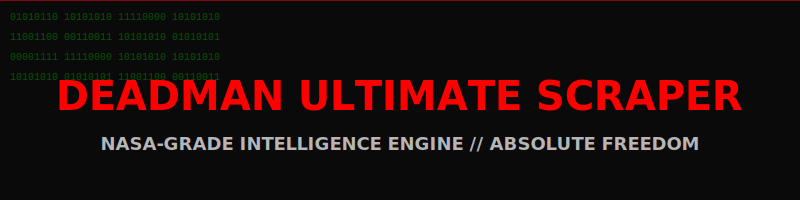

<div align="center">



# DEADMAN ULTIMATE SCRAPER // PROJECT PORTAL
### NASA-Standard Multi-Project Intelligence Infrastructure

[](https://github.com/DeadManOfficial/DeadManUltimateScraper)
[](https://github.com/DeadManOfficial/DeadManUltimateScraper/tree/main/scraper)

</div>

---

## 📂 Project Architecture

This repository is organized into distinct functional domains to maintain NASA-standard modularity and reusability.

### **1. [Core Scraper Framework (God Module)](./scraper/)**
The high-fidelity engine that coordinates the entire intelligence gather stack.
- **Location:** `./scraper/`
- **Primary API:** `central_scraper.py`
- **Features:** 5-Layer Fetching, JA4 Fingerprinting, Session Hijacking.

### **2. Global Configuration & Shared Data**
- **[./config/](./config/):** Centralized YAML manifests for cross-project parameters.
- **[./data/](./data/):** Unified storage for intelligence databases and cached assets.
- **[./tor/](./tor/):** Integrated portable TOR circuit infrastructure.

---

## ⚡ Quick Start

```bash
# 1. Initialize the Armory
git clone https://github.com/DeadManOfficial/DeadManUltimateScraper.git
cd DeadManUltimateScraper

# 2. Access the God Module
cd scraper
pip install .
```

---

<div align="center">

**Created by DEADMAN**

*"The best scraper since god made light."*

[](https://github.com/DeadManOfficial)

</div>
